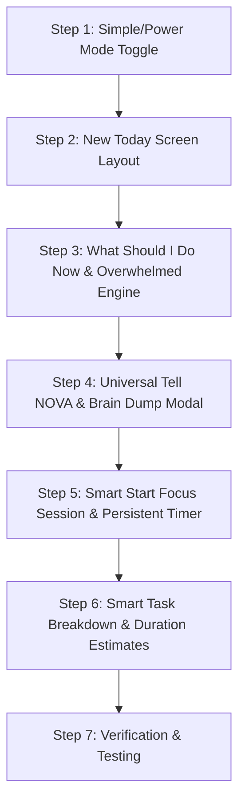

# NOVA 2.0 — Selected High-Impact Priority Features
*Second-Generation UX & Intelligence Remodel (Curated Selection)*

---

## Executive Summary & Core Philosophy

Rather than attempting to implement all 40 remodel phases at once—which would risk regressions, bloat, and cognitive overload—we have selected the **8 most impactful, foundational features** from the Second-Generation specification.

### The Core Shift
```
From: "An application containing 8 separate productivity tools"
  To: "An intelligent personal operating system where you tell NOVA what you need, and NOVA figures out the organization."
```

By prioritizing these 8 features, NOVA will:
1. **Never overwhelm the user**: Replace endless lists with clear, curated next actions.
2. **Eliminate decision paralysis**: When a user is stuck or has 30 free minutes, NOVA tells them *exactly* what to do and *why*.
3. **Handle natural language capture**: Users don't need to choose between Tasks, Projects, Notes, or Calendar. They just type or paste raw thoughts.
4. **Bridge the gap between planning and doing**: A persistent focus timer with micro-objectives turns intentions into finished work.
5. **Preserve all existing systems**: 100% reuse of existing Supabase tables (`tasks`, `projects`, `calendar_events`, `user_preferences`), existing backend endpoints (`/api/ai`, `/api/planner`), and existing integrations.

---

## The Essential 8 Priority Features

| # | Feature | Target Phase | Primary User Value |
|---|---|---|---|
| **1** | **New "Today" Home Experience** | Phase 1 & 11 | Eliminates dashboard clutter; highlights Focus, Next, Upcoming with transparent "Why?" explanations. |
| **2** | **Universal "Tell NOVA" Input & Intent Router** | Phase 2 | One single natural language input to control all of NOVA without knowing which tool is responsible. |
| **3** | **Brain Dump Mode with Review Screen** | Phase 3 | Paste 10 raw thoughts at once; NOVA categorizes into tasks/projects/notes without blindly mutating data. |
| **4** | **"What Should I Do Now?" Decision Engine** | Phase 4 | Instant 1-click answer based on free calendar gap, deadlines, and active tasks. |
| **5** | **"I'm Overwhelmed" Relief Mode** | Phase 5 | Calms anxiety by hiding backlog clutter and isolating the top 2–3 mission-critical items. |
| **6** | **Persistent Focus Session ("Start" Experience)** | Phase 8 & 9 | Immersive execution mode with live timer that **survives page refreshes**, ending with a break prompt. |
| **7** | **Smart Task Breakdown & Duration Estimates** | Phase 6 & 7 | Auto-breaks intimidating tasks into 15–45 min steps with user approval, boosting planner accuracy. |
| **8** | **Simple Mode vs. Power Mode Toggle** | Phase 12 | Declutters navigation to 5 essentials for beginners, while preserving all power tools for advanced users. |

---

## Detailed Breakdown of Each Priority Feature

---

### Feature 1: The New "Today" Home Experience (Phases 1 & 11)

#### What is it?
Replaces the old 4-statistic grid and multi-card widget dashboard with a serene, intelligent **Today** home screen.

#### Layout Structure
```
Good morning, Ashwath
Here's what matters today.

-----------------------------------------------------------
YOUR FOCUS
1. Finish Science Assignment
   Due today • ~45 min
   [ ▶ Start ]   [ Why? ]

NEXT
• Math Revision (~30 min)

UPCOMING
• 5:30 PM  Workout
• 7:00 PM  Project Standup
-----------------------------------------------------------
[ View full schedule / all tasks → ]
```

#### Why is it useful?
- **Reduces Cognitive Load**: When opening NOVA, users shouldn't have to parse 4 stat boxes, 3 scrollable columns, and a dozen tasks. They need to know what to start right now.
- **Trust via "Why?" (Phase 11)**: Clicking `[ Why? ]` opens an explanation based on real data:  
  *"Due today, estimated 45 minutes, and you have a 60-minute open block before your 5:30 PM workout."*  
  NOVA never invents fake justifications.
- **No Empty Clutter**: If there are no calendar events, the Upcoming section simply hides instead of showing a blank empty state.

#### How it connects to existing systems:
- Reuses `window.supabaseClient.from('tasks')` and existing Google Calendar sync endpoint `/api/integrations/google-calendar/events`.
- Upgrades `tpl-overview` in `app.html` and `novaOverview.loadOverview()` in `js/app.js`.

---

### Feature 2: Universal "Tell NOVA" Input & Intent Router (Phase 2)

#### What is it?
A prominent, always-available natural language input at the top of the Today screen and Topbar:
```
-------------------------------------------------------------
What do you need?
[ Tell NOVA anything... (e.g. "Physics homework due tomorrow") ] ✦
-------------------------------------------------------------
```

#### Why is it useful?
- **Frictionless Capture**: The user doesn't need to ask: *"Do I go to Tasks, Projects, Calendar, or Planner?"*
- They simply state their intent:
  - *"Finish my physics homework tomorrow"* → Identifies task + due date.
  - *"Remind me to call mom at 7"* → Identifies time-bound reminder/event.
  - *"I have a math exam next Friday"* → Identifies project / milestone.
  - *"I'm overwhelmed"* → Triggers the Overwhelmed relief view.
  - *"What should I do now?"* → Triggers the smart recommendation.

#### How it connects to existing systems:
- Feeds into our existing `/api/ai` endpoint and `server/context-engine.js`.
- Rather than a plain conversational chatbot window, it returns structured **Command Result Cards** directly in the UI.

---

### Feature 3: Brain Dump Mode with Review Screen (Phase 3)

#### What is it?
A distraction-free modal triggered by a `[ Brain Dump ]` button beside the Universal Input.

#### User Flow
1. User clicks `[ Brain Dump ]`.
2. A clean, spacious modal opens: *"Get everything out of your head."*
3. The user types or pastes a stream of thoughts:
   ```text
   I need to finish the science project, study math chapter 3,
   call Rahul tomorrow, buy mom a birthday gift, work on NOVA,
   and email the professor about lab hours.
   ```
4. Clicking `[ Analyze Dump ]` parses the text into classified categories.
5. **CRITICAL UX (The Review Screen)**:
   ```
   I found 5 items:
   ☑ [TASK] Finish science project (Due: Tomorrow, ~45m)
   ☑ [TASK] Study math chapter 3 (~60m)
   ☑ [REMINDER] Call Rahul (Time: Tomorrow evening)
   ☑ [NOTE] Buy mom a birthday gift
   ☑ [TASK] Email professor about lab hours

   [ Create All (5) ]   [ Edit Items ]   [ Cancel ]
   ```
6. NOVA **never blindly inserts data**. The user approves the list with one click, or unchecks items they don't want.

#### Why is it useful?
Students and busy professionals often have 10 swirling obligations. Being able to dump raw thoughts and have NOVA clean, categorize, and batch-create them saves 15 minutes of manual clicking.

#### How it connects to existing systems:
- Calls `/api/ai` with a structured JSON schema instruction.
- Inserts validated results into existing `tasks` and `notes` Supabase tables via bulk insert.

---

### Feature 4: "What Should I Do Now?" Decision Engine (Phase 4)

#### What is it?
A high-visibility one-click action button on the Today page:
```
[ ✦ What should I do now? ]
```

#### How it evaluates:
1. Current time & available gap before the next scheduled calendar event.
2. Overdue tasks & tasks due today.
3. Priority weights (High > Medium > Low).
4. Estimated durations (e.g. task takes 45 mins, free gap is 55 mins = perfect match).

#### The Output:
```
-----------------------------------------------------------
RECOMMENDED NOW

Science Assignment
~45 min • Due Today

"You have 55 free minutes before your 5:30 PM workout.
This assignment is due today and will take about 45 minutes."

[ ▶ Start Now ]     [ Choose Something Else ]
-----------------------------------------------------------
```

#### Why is it useful?
Solves the "in-between time" paralysis. When someone finishes a meeting at 2:15 PM and their next call is at 3:00 PM, they usually waste the 45 minutes on social media. NOVA immediately tells them what fits the gap.

#### How it connects to existing systems:
- Client-side decision engine in `js/planner.js` or `js/app.js` using loaded active tasks and calendar events. Fast, instant (0ms latency, no unnecessary API cost).

---

### Feature 5: "I'm Overwhelmed" Relief Mode (Phase 5)

#### What is it?
A mental health and anti-burnout feature accessible via button `[ ✦ I'm overwhelmed ]` or typing *"I have too much to do"* into NOVA.

#### The Experience:
```
-----------------------------------------------------------
Let's simplify this. Take a breath.
-----------------------------------------------------------
You have 16 unfinished items.

You do NOT need to do all of them today.
Only focus on these 3 right now:

1. 🔴 Science Assignment (Due today)
2. 🟡 Submit Project Outline (Due tomorrow)
3. 🟢 Review Math Notes (30 min)

Everything else can safely wait.

[ ▶ Start #1 ]     [ Show full backlog ]
-----------------------------------------------------------
```

#### Important Safeguards:
- Does **NOT** delete, archive, or cancel any tasks.
- Temporarily filters out low-impact backlog noise so the user's brain can reset.

#### Why is it useful?
Long to-do lists trigger avoidance behavior and paralysis. By cutting through the noise and giving permission to ignore 13 non-urgent tasks, users get moving again.

---

### Feature 6: Smart "Start" Execution & Persistent Focus Session (Phases 8 & 9)

#### What is it?
Clicking `[ ▶ Start ]` on any task (on Today, Kanban, or Planner) switches NOVA into a fullscreen, distraction-free **Focus Mode**.

#### Focus Screen Layout
```
===========================================================
                      FOCUSING
===========================================================
Science Assignment
Estimated: 45 min

                     [ 38:42 ]
                 Remaining of 45:00

Current Micro-Objective:
"Finish introduction and first section"

[ ⏸ Pause ]         [ ✓ Complete Task ]         [ ✕ Exit ]
===========================================================
```

#### Critical Architecture Requirements:
- **Survives Page Refreshes**: Active session state (task ID, start timestamp, paused time, elapsed time) is saved to `localStorage` (and mirrored in Supabase). If the user refreshes, switches tabs, or closes the browser, the timer resumes seamlessly.
- **Explicit Completion**: Never automatically marks a task complete just because the timer hits 0:00.
- **Session Summary & Break Prompt (Phase 9)**:
  ```
  SESSION COMPLETE 🎉
  Science Assignment — 42 minutes focused.
  ✓ Task marked completed.

  Next recommended action:
  Take a 10-minute break. Grab water or stretch!
  [ Take 10m Break ]   [ Continue Working ]
  ```

#### Why is it useful?
Productivity apps fail when they only do list management. NOVA acts as the execution coach that keeps the user on task.

---

### Feature 7: Automatic Task Breakdown & Smart Estimation (Phases 6 & 7)

#### What is it?
1. **Auto-Breakdown**: When a user inputs a vague or intimidating objective (e.g. *"Make Biology Presentation"* or *"Build Portfolio Website"*), NOVA detects the scope and asks:
   ```
   "Would you like me to break 'Make Biology Presentation' into 5 manageable steps?"

   • Research topic & key citations (~30 min)
   • Draft presentation outline (~20 min)
   • Design slides in Canva/Keynote (~45 min)
   • Add charts & diagrams (~30 min)
   • Rehearse speech (~15 min)

   [ Break it down ]   [ Keep as one task ]
   ```
2. **Smart Task Estimation**: Inferred from natural language (e.g. *"Review chapter for 30 min"* automatically sets `estimated_minutes: 30`), with a quick clickable pill selector (15m, 30m, 45m, 1h, 2h+).

#### Why is it useful?
- Vague tasks cause procrastination. Breaking them into 15–45 min chunks removes psychological friction.
- Having estimated durations allows the Schedule Planner to build realistic, conflict-free daily schedules.

#### How it connects to existing systems:
- Stores subtasks in existing `tasks` table with `project_id` or `parent_task_id`.

---

### Feature 8: Simple Mode vs. Power Mode Toggle (Phase 12)

#### What is it?
A quick toggle in Settings (and sidebar footer) that dynamically alters the interface density:

| Mode | Visible Navigation | Best For |
|---|---|---|
| **Simple Mode** (Default for new users) | **Today, Tasks, Calendar, NOVA AI, Settings** | Students, casual users, and anyone wanting zero clutter. |
| **Power Mode** | **Today, Tasks, Projects, Planner, Calendar, Notes, Habits, AI Command, Setup Guide, Settings** | Developers, project managers, and power users who want deep tools. |

#### Important Architecture:
- Simple Mode only changes **presentation & sidebar visibility**; it never disables features or restricts database access.
- Switching between modes is instantaneous (1-click toggle, saved in `localStorage` and `profiles.interface_mode`).

#### Why is it useful?
Solves the paradox of "feature-rich vs. beginner-friendly". Beginners get an ultra-clean 5-item app, while power users get the full command center.

---

## What We Are Deferring & Why

| Deferred Area | Phases Included | Rationale for Deferring |
|---|---|---|
| **Complex Multi-Day Replanning** | Phases 18, 19, 21, 22 | We already have a functioning daily AI Planner (`server/planner-engine.js`). Adding multi-day forecasting before Today and Focus modes are solid adds unnecessary complexity. |
| **Complex Undo History Engine** | Phase 10 | We already have soft confirmations for destructive actions. A full transactional undo engine is safer to build after the core data flows are stabilized. |
| **Advanced Notification Filtering** | Phase 16 | The existing toast and alert system is lightweight and functional. |
| **Full Offline Sync DB** | Phase 27 | Light online/offline banner is useful, but a full IndexedDB bidirectional sync engine is premature until users request offline editing. |

---

## Implementation Roadmap (When Approved)



### Proposed Execution Order:
1. **Sprint 1 (Visual Clarity & Core Navigation)**:
   - Implement **Simple Mode / Power Mode** toggle (Phase 12).
   - Redesign `tpl-overview` into the new **Today Experience** with Focus, Next, Upcoming, and `[ Why? ]` transparency (Phases 1 & 11).
2. **Sprint 2 (Decision & Emotional Intelligence)**:
   - Implement **"What Should I Do Now?"** recommendation engine (Phase 4).
   - Implement **"I'm Overwhelmed"** focus-relief filter (Phase 5).
3. **Sprint 3 (Natural Language Capture)**:
   - Implement **Universal "Tell NOVA"** input on Today & Topbar (Phase 2).
   - Implement **Brain Dump Mode** with the classified Review Screen (Phase 3).
4. **Sprint 4 (Execution & Momentum)**:
   - Implement **Smart "Start" Focus Mode** with localStorage-persisted timer and session break summary (Phases 8 & 9).
   - Implement **Task Breakdown & Smart Estimation** (Phases 6 & 7).

---

## Technical Safeguards Guaranteed
- **Strictly Localhost**: No pushes to GitHub or Render.
- **No Duplicate Systems**: Zero duplicate tables, zero duplicate planners, zero duplicate auth.
- **BYOK Architecture**: Preserves the 1-trial preview and personal Gemini API key model.
- **Preserved RLS & Auth**: Supabase PostgreSQL schemas and security policies remain intact.
